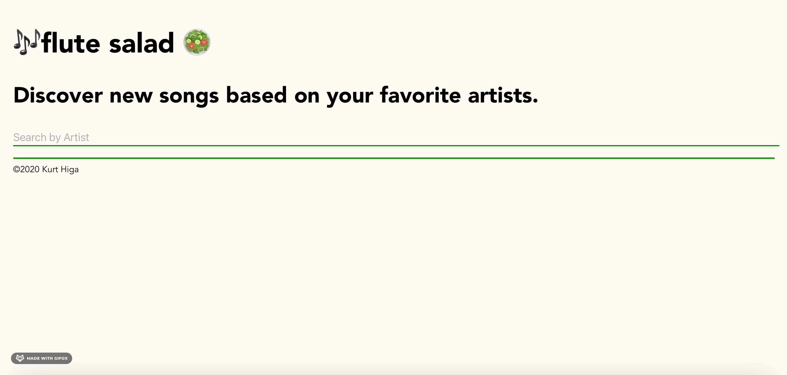

# flute-salad Spotify Discover App

<b>Project</b>: Spotify Discover (Flute Salad)

<b>What is it?</b> This is a web application that uses the Spotify API to allow users to create a savable playlist that includes brand new music based
on their favorite artists.

<b>Reason why I made it:</b> I love listening to music and finding new artists to listen to. 
 
<b>Technology used:</b> Vue, Vuex for state management, Spotify RESTful api

<b>How it works:</b>
The app allows the user to input their favorite artist as a search string. Using the spotify api, the app looks up that artist on Spotify and displays a list of artists that contain that string. Then it finds artists that make similar music. Then the app displays a playlist with popular songs from the related artists. Users are given the option to save that playlist to their spotify account. 

<b>Challenge:</b> I had to work with a large set of data pulled from the spotify api and that data was being manipulated by multiple components. So at first I had problems where when I was working with certain arrays, that array was not yet computed when it was needed.  In order to fix this issue, I had to learn about the VueX state management pattern and completely change the structure of the project. I created a centralized store file and all the variables and states shared between the components were stored in that file. Components are able to get, set, and mutate variables inside the store.

From this project, I was able to learn about state management with VueX and manipulating data that was drawn from a RESTful API. 

Try it here:

step 1: https://flute-salad.herokuapp.com/

step 2: Connect to your Spotify account.

step 3: Search for your favorite artist.

step 4: Save new playlist.

Things to work on:

- a more reactive design
- allow user to add more than one artist (up to 5)
- filter out songs that are already liked by user
- create a filter menu (number of tracks, genre, mood)
- add database to store all playlists created with application (maybe keep 5 most recently created)
- display previews of recently created playlists, which users can click into  -> display ->option to save
